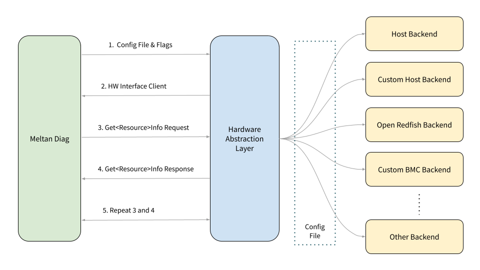

# OCPDiag hardware interface

<!--*
freshness: { owner: 'yuanlinw' reviewed: '2021-09-20' }
*-->

This page describes how to define and use the OCPDiag Hardware Interface.

## Overview

In some scenarios, the way that a diagnostic interrogates device under test
(DUT) hardware may not be consistent in different environments. This can be due
to the execution environment of a diagnostic or a requirement for a diagnostic
to reference a unique hardware identifier to interface with shop-floor control
systems or workflow systems for operations.

The OCPDiag framework includes an optional hardware interface that provides a
communication abstraction layer for a device under test. Using the interface may
not always be necessary particularly in cases where the diagnostic can
communicate to the hardware directly. In some scenarios, the use of a shim can
be beneficial.

The diagram above describes the workflow of using a Hardware Abstraction Layer
(HAL):

1.  The test configures HAL via configuration file or command-line flags.
2.  HAL receives the configuration and returns a client for the test to use.
3.  The test sends `Get<Resource>InfoRequest` to HAL.
4.  HAL returns `Get<Resouce>InfoResponse` to the test
    *   Based on the configuraion, HAL uses different backends to query
        information for this `<Resource>`
    *   Our current backends include `HOST`, `REDFISH`,
        `BMC_DIAGNOSTIC_INTERFACE`.
5.  Repeat 3 and 4

The detailed documentation diving into the configuration file, API definition,
client creation, example test, and each backend implementation is coming soon.
